# PROJ1 - on Query Optimization

**OBS:** I recommend reading the report in the repository README on GitHub, as the PDF version is automatically generated from the Markdown file and may not display images and hyperlinks well formated.

**GitHub repostiory:** [https://github.com/lucasouzamil/proj1-tbd-feup](https://github.com/lucasouzamil/proj1-tbd-feup) 

**Student:** [Lucas Fernando de Souza Lima](https://github.com/lucasouzamil) 

**Student Number:** 202512136

The description of this project and the requirements can be checked on the PDF file [PROJ1-EDA.pdf](./PROJ1-EDA.pdf).


## Table of Contents

- [Data Setup](#data-setup)
  - [Copying Data](#copying-data)
  - [Setting Up](#setting-up)
    - [X Environment](#x-environment)
    - [Y Environment](#y-environment)
    - [Z Environment](#z-environment)

- [1. Selection and Join](#1-selection-and-join)
  - [a. Municipality 1103](#a-what-are-the-codes-and-names-of-parishes-belonging-to-municipality-1103)
  - [a. Azambuja](#a-what-are-the-codes-and-names-of-parishes-belonging-to-municipality-with-the-name-azambuja)
  - [b. Lisbon mandates](#b-indicate-the-party-acronyms-designations-and-number-of-mandates-obtained-in-the-district-of-lisbon)
  - [c. BE votes in Lisbon district parishes](#a-indicate-the-number-of-votes-obtained-by-the-party-be-in-parishes-of-the-lisbon-district)

- [2. Aggregation](#2-aggregation)
  - [a. PS votes nationwide](#a-how-many-votes-did-the-party-ps-obtain-nationwide)
  - [b. Votes by party in each district](#b-how-many-votes-did-each-party-obtain-in-each-district)
  - [c. Highest vote in a parish](#c-which-party-obtained-the-highest-number-of-votes-in-a-parish-indicate-the-party-acronym-parish-name-and-the-corresponding-votes)
  - [d. Highest vote by district](#d-for-each-district-indicate-its-name-and-the-party-that-obtained-the-highest-number-of-votes-in-that-district)

- [3. Negation](#3-negation)
  - [Parties that did not compete in Lisbon](#likewise-in-question-2-analyze-the-query-which-parties-did-not-compete-in-the-district-of-lisbon)

- [4. Universal Query](#4-universal-query)

- [5. Compare execution plans in Z](#5-compare-execution-plans-for-the-query-how-many-votes-did-ps-and-psd-obtain-in-districts-11-15-and-17-considering-in-environment-z)
  - [a. B-tree indexes](#a-using-b-tree-indexes-on-zconcelhosdistrito-e-zvotacoespartido)
  - [b. Bitmap indexes](#b-using-bitmap-indexes)

## Data Setup

Before starting building queries and analyzing the execution plan of them, it's necessary to copy the required database of the project and setting up each environment. You can check the entire SQL file that does it on [sql/data-setup.sql](./sql/data-setup.sql).

### Copying Data

For each environment was copied the respective table from the GTD7 user. 

``` SQL
-- Environment data copy example
DROP TABLE <environment letter>distritos CASCADE CONSTRAINTS PURGE;
DROP TABLE <environment letter>concelhos CASCADE CONSTRAINTS PURGE;
DROP TABLE <environment letter>freguesias CASCADE CONSTRAINTS PURGE;
DROP TABLE <environment letter>partidos CASCADE CONSTRAINTS PURGE;
DROP TABLE <environment letter>votacoes CASCADE CONSTRAINTS PURGE;
DROP TABLE <environment letter>listas CASCADE CONSTRAINTS PURGE;
DROP TABLE <environment letter>participacoes CASCADE CONSTRAINTS PURGE;

CREATE TABLE <environment letter>distritos AS SELECT * FROM GTD7.DISTRITOS;
CREATE TABLE <environment letter>concelhos AS SELECT * FROM GTD7.CONCELHOS;
CREATE TABLE <environment letter>freguesias AS SELECT * FROM GTD7.FREGUESIAS;
CREATE TABLE <environment letter>partidos AS SELECT * FROM GTD7.PARTIDOS;
CREATE TABLE <environment letter>votacoes AS SELECT * FROM GTD7.VOTACOES;
CREATE TABLE <environment letter>listas AS SELECT * FROM GTD7.LISTAS;
CREATE TABLE <environment letter>participacoes AS SELECT * FROM GTD7.PARTICIPACOES;
```

### Setting Up

Each environment was modified to match with the environments requirements on the PDF file. 

#### X Environment

Without indexes or integrity constraints (nothing to do, only the raw data copied from GTD7 user).

#### Y Environment

With standard integrity constraints (PK + FK). All the tables were modified to add the respective keys.

``` SQL
-- Y environment setting up example
-- Primary Key example on Distritos table
ALTER TABLE ydistritos ADD CONSTRAINT pk_ydistritos PRIMARY KEY (codigo);

-- Foreign Key example on Concelhos table
ALTER TABLE yconcelhos ADD CONSTRAINT fk_yconcelhos_distrito FOREIGN KEY (distrito) REFERENCES ydistritos (codigo);
```

#### Z Environment

With standard integrity constraints and any additional indexes you consider appropriate, justifying the reason for including each of them.

Additional indexes were created on the columns that are supposed to be the most frequently used in join and filter conditions in the queries. These indexes are expected to help speed up access by district, municipality, parish, and party, since these are the attributes most used in the proposed queries. They should help reduce full table scans and potentially improve overall performance, especially in join and filtering operations.

``` SQL
CREATE INDEX idx_zconcelhos_distrito
  ON zconcelhos (distrito);

CREATE INDEX idx_zfreguesias_concelho
  ON zfreguesias (concelho);

CREATE INDEX idx_zlistas_distrito
  ON zlistas (distrito);

CREATE INDEX idx_zlistas_partido
  ON zlistas (partido);

CREATE INDEX idx_zvotacoes_freguesia
  ON zvotacoes (freguesia);
```


## 1. Selection and Join

All the queries according to this step can be checked on the file [sql/1-selection-and-join.sql](./sql/1-selection-and-join.sql).

### a. What are the codes and names of parishes belonging to municipality 1103?

#### SQL formulation

``` SQL
SELECT f.codigo, f.nome
FROM <environment letter>freguesias f
WHERE f.concelho = 1103;
```

#### Result
```
    CODIGO NOME                                              
---------- --------------------------------------------------
    110301 Alcoentre                                         
    110302 Aveiras de Baixo                                  
    110303 Aveiras de Cima                                   
    110304 Azambuja                                          
    110305 Manique do Intendente                             
    110306 Vale do Paraiso                                   
    110307 Vila Nova da Rainha                               
    110308 Vila Nova de São Pedro                            
    110309 Maçussa                                           

9 linhas selecionadas. 
```

#### Execution plans and estimate the effort required
* X environment


* Y environment

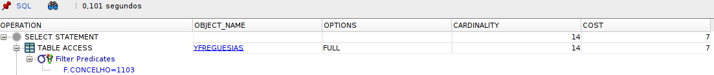

* Z environment

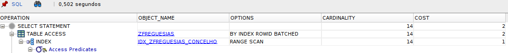


#### Analysis

In **X** and **Y**, the database does a **full table scan** on `freguesias`. This happens because there is no index on the `concelho` column, so it has to check all rows to find the matches. Even with primary and foreign keys in **Y**, the execution plan is basically the same as **X**, with the same cost (**7**).

In **Z**, the plan is different. The database uses the index `IDX_ZFREGUESIAS_CONCELHO` with an **index range scan**, which means it can go directly to the rows where `concelho = 1103`. Because of that, the cost drops to **2**, showing a more efficient plan.

Even though the execution time in this run is a bit higher in **Z**, the plan itself is better. Since the table is small, this difference in time is not very meaningful. In larger datasets, using the index would likely be faster.


### a. What are the codes and names of parishes belonging to municipality with the name 'Azambuja'?

#### SQL formulation

``` SQL
SELECT f.codigo, f.nome
FROM <environment letter>freguesias f
JOIN <environment letter>concelhos c ON c.codigo = f.concelho
WHERE c.nome = 'Azambuja';
```

#### Result
```
    CODIGO NOME                                              
---------- --------------------------------------------------
    110301 Alcoentre                                         
    110302 Aveiras de Baixo                                  
    110303 Aveiras de Cima                                   
    110304 Azambuja                                          
    110305 Manique do Intendente                             
    110306 Vale do Paraiso                                   
    110307 Vila Nova da Rainha                               
    110308 Vila Nova de São Pedro                            
    110309 Maçussa                                           

9 linhas selecionadas.
```

#### Execution plans and estimate the effort required
* X environment

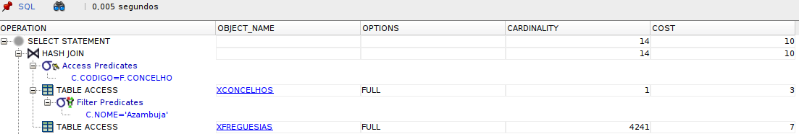

* Y environment

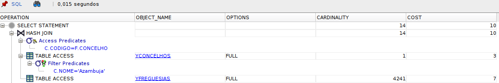

* Z environment

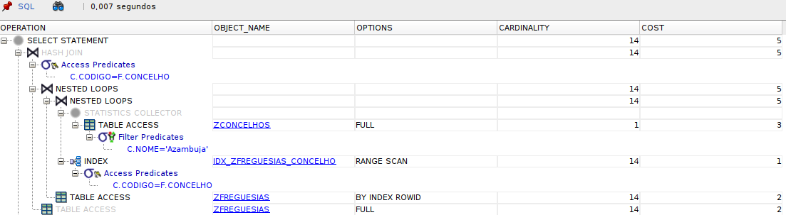


#### Analysis

In **X** and **Y**, the plan is basically the same. The database does a **full table scan** on `concelhos` to find `nome = 'Azambuja'`, and then another **full table scan** on `freguesias`. Since there is no index on `freguesias.concelho`, the optimizer uses a **hash join** to match the rows. Even with the PK/FK constraints in **Y**, the plan does not really change, because those constraints do not help with this filter. The estimated cost stays at **10**.

In **Z**, the plan changes. The database still scans `concelhos` to find **Azambuja**, but then it uses the index `IDX_ZFREGUESIAS_CONCELHO` to get the matching parishes. Because of that, the join becomes a **nested loops** plan instead of a full scan on `freguesias`. This reduces the cost to **5**, so the optimizer sees it as a cheaper plan.

The execution time is also a bit better in **Z**, but the main difference is really in the execution plan. The index on `zfreguesias.concelho` is what makes the join more efficient here.


### b. Indicate the party acronyms, designations, and number of mandates obtained in the district of Lisbon.

#### SQL formulation

``` SQL
SELECT p.sigla, p.designacao, l.mandatos
FROM <environment letter>listas l
JOIN <environment letter>partidos p ON p.sigla = l.partido
JOIN <environment letter>distritos d ON d.codigo = l.distrito
WHERE d.nome = 'Lisboa';
```

#### Result
```
SIGLA      DESIGNACAO                                             MANDATOS
---------- ---------------------------------------------------- ----------
PSN        Partido Solidariedade Nacional                                0
PS         Partido Socialista                                           23
PPM        Partido Popular Monárquico                                    0
POUS       Partido Operário de Unidade Socialista                        0
PH         Partido Humanista                                             0
PPDPSD     Partido Social Democrata                                     14
PCTPMRPP   Partido Comunista dos Trabalhadores Portugueses               0
PCPPEV     Partido Comunista Português                                   6
CDSPP      Partido Popular                                               4
BE         Bloco de Esquerda                                             2
MPT        Movimento Partido da Terra                                    0

11 linhas selecionadas. 
```

#### Execution plans and estimate the effort required
* X environment

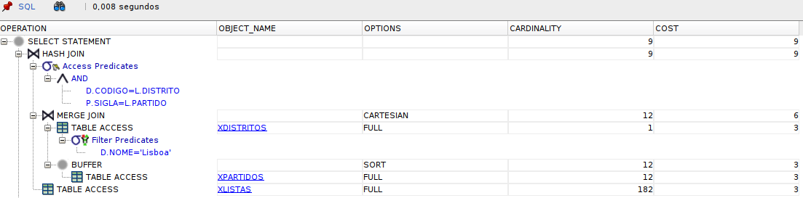

* Y environment

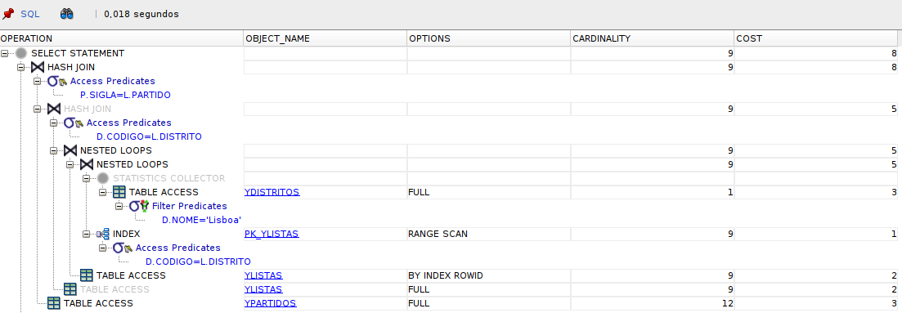

* Z environment

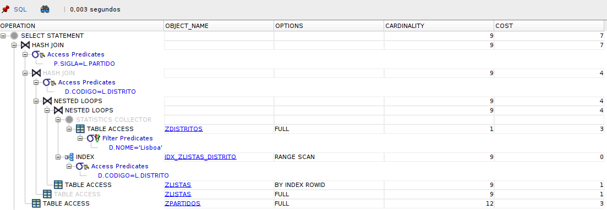


#### Analysis

In **X**, the plan is the least efficient one. The database does a **full scan** on `distritos`, `listas`, and `partidos`. It also uses a **merge join cartesian** in part of the plan, which is usually a sign that the optimizer had fewer good options to connect the tables efficiently. Since there are no indexes or constraints, it has to work with full scans and then combine the rows. The cost is **9**.

In **Y**, the plan improves a bit. The database still does a **full scan** on `distritos` to find `nome = 'Lisboa'`, but now it can use the primary key index on `listas` (`PK_YLISTAS`) with an **index range scan**. That makes the join between `distritos` and `listas` more efficient. `partidos` is still read with a full scan, but the overall cost drops to **8**.

In **Z**, the plan is the best one of the three. It keeps the same general structure as **Y**, but now it uses the extra index `IDX_ZLISTAS_DISTRITO` on `listas.distrito`. That gives the optimizer a more direct way to reach the rows for Lisbon, so the cost goes down again, to **7**. The execution time is also the lowest in this run.


### a. Indicate the number of votes obtained by the party BE in parishes of the Lisbon district.

#### SQL formulation

``` SQL
SELECT SUM(v.votos) AS total_votos
FROM <environment letter>votacoes v
JOIN <environment letter>freguesias f ON f.codigo = v.freguesia
JOIN <environment letter>concelhos c  ON c.codigo = f.concelho
JOIN <environment letter>distritos d  ON d.codigo = c.distrito
WHERE v.partido = 'BE' AND d.nome = 'Lisboa';
```

#### Result
```
TOTAL_VOTOS
-----------
      55113
```

#### Execution plans and estimate the effort required
* X environment

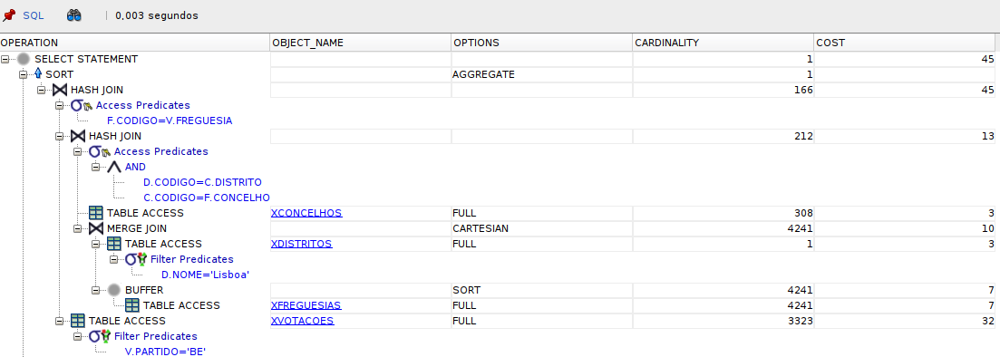

* Y environment

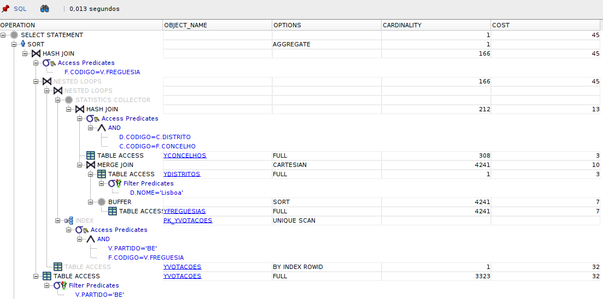

* Z environment

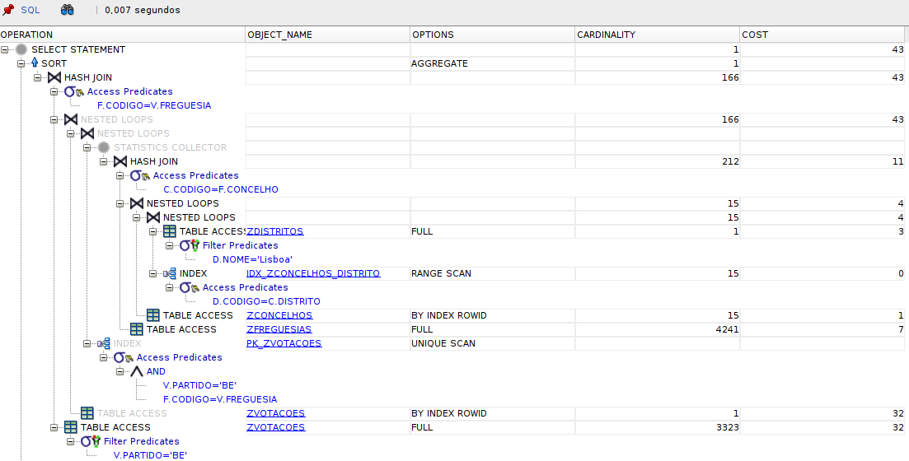

#### Analysis

In **X**, the plan is the heaviest one. The database does **full table scans** on `distritos`, `concelhos`, `freguesias`, and `votacoes`, and then connects everything with **hash joins**. This happens because there are no indexes to help with the filter `v.partido = 'BE'` or with the joins between the tables. The estimated cost is **45**, which reflects that the optimizer has to inspect most of the data before reaching the final result.

In **Y**, the plan improves a bit. The biggest change is on `votacoes`, where Oracle uses the primary key index with a **unique scan** and then a **table access by rowid**. That helps because `partido` is part of the primary key, so the database can reach the BE rows more directly. Even so, the other tables are still read with **full scans**, so the query still does a lot of work. The cost stays at **45**, so the improvement is limited.

In **Z**, the plan becomes a little better again. The database now uses the extra index on `zconcelhos.distrito` with an **index range scan**, which helps the join path from `distritos` to `concelhos`. The access to `votacoes` also stays efficient thanks to the primary key index. Because of that, the cost drops slightly to **43**. The execution time is also lower in this run.


## 2. Aggregation

All the queries according to this step can be checked on the file [sql/2-aggregation.sql](./sql/2-aggregation.sql).

### a. How many votes did the party PS obtain nationwide?

#### SQL formulation

``` SQL
SELECT SUM(NVL(votos, 0)) AS total_votos
FROM <environment letter>votacoes
WHERE partido = 'PS';
```

#### Result
```
TOTAL_VOTOS
-----------
    2359939
```

#### Execution plans and estimate the effort required
* X environment

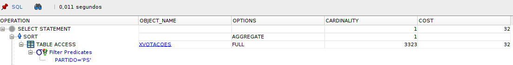

* Y environment

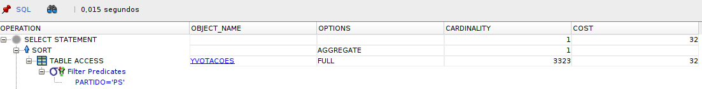

* Z environment


#### Analysis

In all three environments, the execution plan is exactly the same. The database performs a **full table scan** on `votacoes` and then applies the filter `partido = 'PS'`, followed by the aggregation.

This happens because there is no index that can be effectively used for this filter. Even though `partido` is part of the primary key in **Y** and **Z**, the optimizer still chooses a full scan, likely because it expects a large number of rows to match (low selectivity). In this case, scanning the whole table is considered cheaper than using an index.


### b. How many votes did each party obtain in each district?

#### SQL formulation

``` SQL
SELECT d.codigo AS distrito_codigo,
       d.nome   AS distrito_nome,
       p.sigla  AS partido_sigla,
       p.designacao,
       SUM(NVL(v.votos, 0)) AS total_votos
FROM <environment letter>votacoes v
JOIN <environment letter>freguesias f ON f.codigo = v.freguesia
JOIN <environment letter>concelhos c  ON c.codigo = f.concelho
JOIN <environment letter>distritos d  ON d.codigo = c.distrito
JOIN <environment letter>partidos p   ON p.sigla = v.partido
GROUP BY d.codigo, d.nome, p.sigla, p.designacao
ORDER BY d.codigo, p.sigla;
```

#### Result

The output of the query is too large, because of this the result is on the file [results/2-b](./results/2-b)

#### Execution plans and estimate the effort required
* X environment

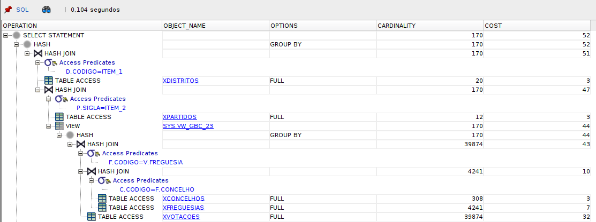

* Y environment

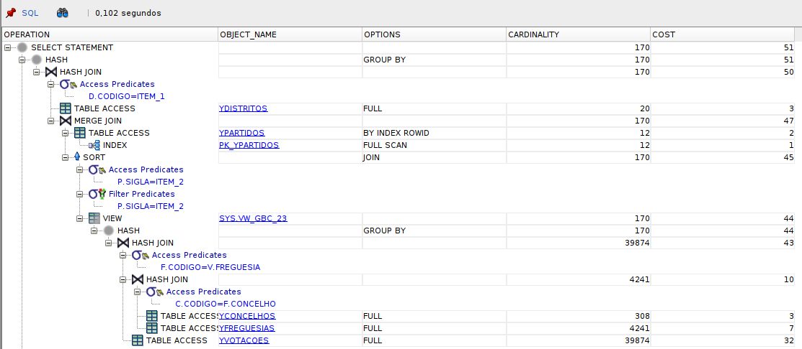

* Z environment

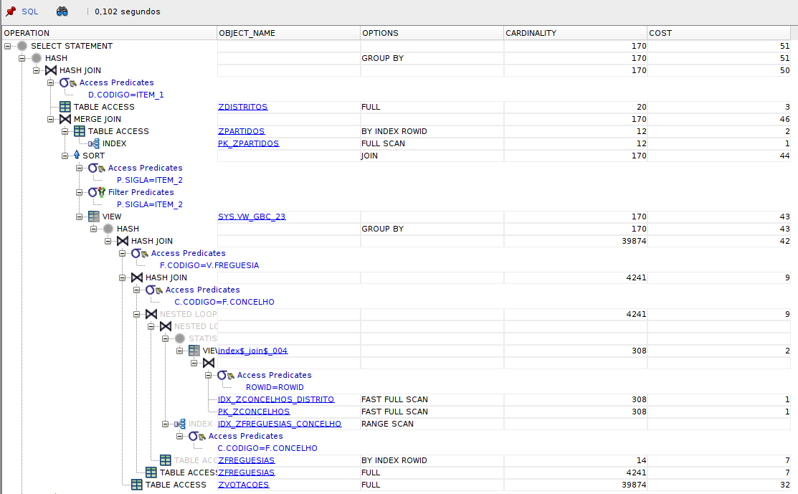


#### Analysis

This query is much heavier than the previous ones because it has to read and group a lot of vote data. In **X**, the plan is mostly based on **full table scans** and **hash joins** across `votacoes`, `freguesias`, `concelhos`, `distritos`, and `partidos`. Since there are no helpful indexes, Oracle has to process the tables almost entirely before doing the `GROUP BY`. The cost is **52**.

In **Y**, the plan gets a small improvement. The database uses the primary key on `partidos` with a **by index rowid** access, so it does not need to scan that table completely. Still, the main part of the work remains the same, because `votacoes`, `freguesias`, and `concelhos` are still read with **full scans**. That is why the cost only drops a little, from **52** to **51**.

In **Z**, the plan becomes a bit better in the territorial joins. The extra indexes on `zconcelhos.distrito` and `zfreguesias.concelho` let Oracle use **index range scans** instead of scanning those tables blindly. So the path from district to parish is more efficient here. Even so, the query still needs to process a large part of `zvotacoes`, so the overall cost stays close to the previous one, and the runtime only changes slightly.

This query is expensive in all environments because it aggregates a lot of data.


### c. Which party obtained the highest number of votes in a parish? Indicate the party acronym, parish name, and the corresponding votes

#### SQL formulation

``` SQL
SELECT p.sigla AS partido_sigla,
       f.nome  AS freguesia_nome,
       v.votos
FROM <environment letter>votacoes v
JOIN <environment letter>partidos p   ON p.sigla = v.partido
JOIN <environment letter>freguesias f ON f.codigo = v.freguesia
WHERE NVL(v.votos, 0) = (
    SELECT MAX(NVL(v2.votos, 0))
    FROM <environment letter>votacoes v2
);
```

#### Result
```
PARTIDO_SI FREGUESIA_NOME                                          VOTOS
---------- -------------------------------------------------- ----------
PS         Agualva-Cacem                                           15188
```

#### Execution plans and estimate the effort required
* X environment

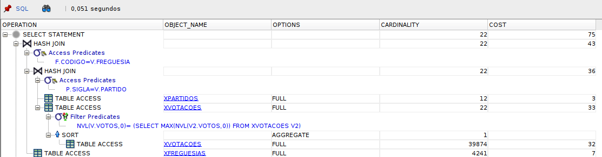

* Y environment


* Z environment

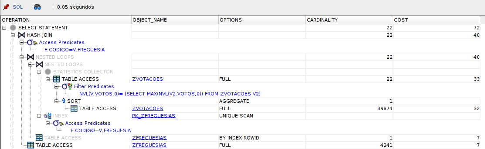

#### Analysis

This query is expensive in all three environments because it has to find the **maximum vote count over the whole `votacoes` table** before returning the matching row.

In **X**, Oracle does **full table scans** on `votacoes`, `freguesias`, and `partidos`. The subquery that finds the maximum also scans `votacoes`, so the table is read more than once. This is why the cost is the highest here, at **75**.

In **Y**, the plan gets a small improvement. Oracle still scans `votacoes` to compute the maximum, but it can use the **primary key index** on `freguesias` to fetch the parish row directly with a **unique scan**. That avoids a full scan on `freguesias`, so the cost drops a little to **72**.

In **Z**, the plan is almost the same as **Y**. The extra indexes do not really help much here, because the main work is still the full scan on `votacoes` for the `MAX()` subquery. The join to `freguesias` is still done efficiently through the primary key, but the total cost stays around **72**.

The main point is, this query is dominated by the search for the global maximum vote count, and that part cannot benefit much from the extra indexes. The indexes only help a little on the join side, not on the aggregation itself.


### d. For each district, indicate its name and the party that obtained the highest number of votes in that district.

#### SQL formulation

``` SQL
SELECT d.nome AS distrito_nome,
       p.sigla AS partido_sigla,
       SUM(NVL(v.votos, 0)) AS total_votos
FROM <environment letter>votacoes v
JOIN <environment letter>freguesias f ON f.codigo = v.freguesia
JOIN <environment letter>concelhos c  ON c.codigo = f.concelho
JOIN <environment letter>distritos d  ON d.codigo = c.distrito
JOIN <environment letter>partidos p   ON p.sigla = v.partido
GROUP BY d.codigo, d.nome, p.sigla
HAVING SUM(NVL(v.votos, 0)) = (
    SELECT MAX(total_votos)
    FROM (
        SELECT SUM(NVL(v2.votos, 0)) AS total_votos
        FROM <environment letter>votacoes v2
        JOIN <environment letter>freguesias f2 ON f2.codigo = v2.freguesia
        JOIN <environment letter>concelhos c2  ON c2.codigo = f2.concelho
        WHERE c2.distrito = d.codigo
        GROUP BY v2.partido
    )
);
```

#### Result
```

DISTRITO_NOME                                      PARTIDO_SI TOTAL_VOTOS
-------------------------------------------------- ---------- -----------
Évora                                              PS               42257
Santarém                                           PS              110326
Aveiro                                             PS              145575
Açores                                             PS               49947
Bragança                                           PPDPSD           36841
Viana do Castelo                                   PS               55132
Beja                                               PS               39728
Viseu                                              PPDPSD           90116
Leiria                                             PPDPSD           99091
Guarda                                             PS               44254
Portalegre                                         PS               36545
Faro                                               PS               87162
Lisboa                                             PS              480410
Vila Real                                          PPDPSD           56507
Porto                                              PS              440162
Coimbra                                            PS              109956
Castelo Branco                                     PS               63398
Madeira                                            PPDPSD           56302
Setúbal                                            PS              170193
Braga                                              PS              195602
```

#### Execution plans and estimate the effort required
* X environment

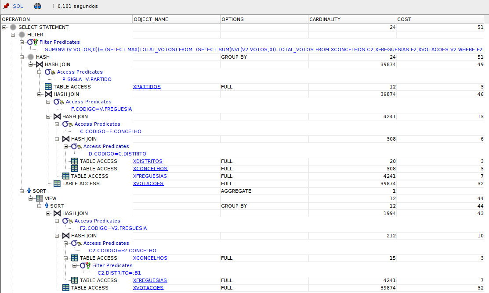

* Y environment

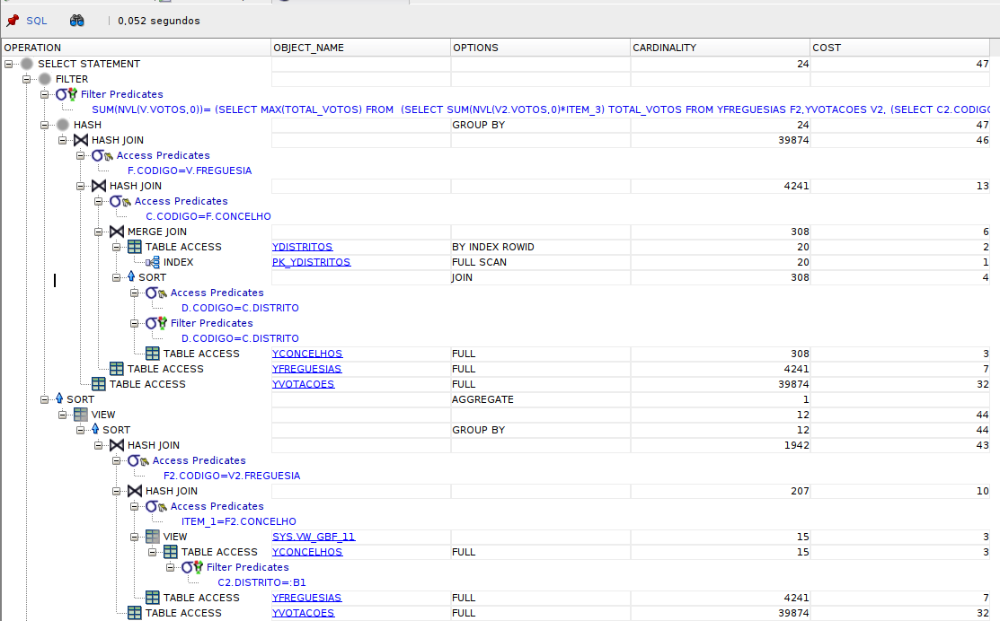

* Z environment

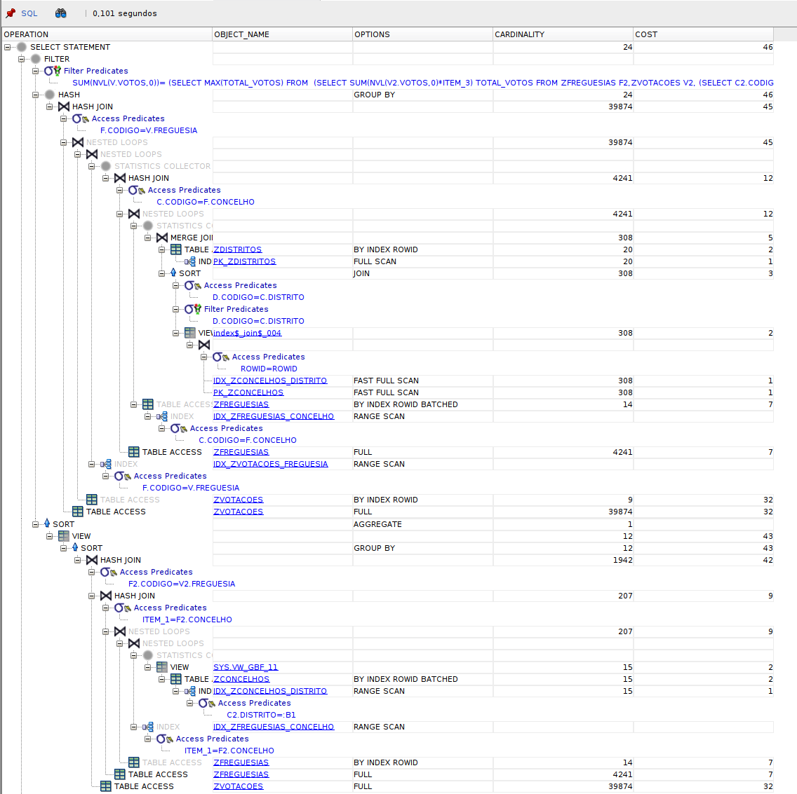

#### Analysis

#### Analysis

This query is have as well, because it has to calculate the winner party **for every district**, which means a lot of grouping and repeated joins over the vote data.

In **X**, the plan is basically built around **full table scans** and **hash joins**. Oracle scans `votacoes`, `freguesias`, `concelhos`, `distritos`, and `partidos`, and then repeats the same kind of work inside the subquery used to find the maximum votes per district. That makes the plan expensive, with a cost of **51**.

In **Y**, the plan improves a little. Oracle still scans most tables, but it can use the primary key index on `partidos` with a **by index rowid** access, so it does not need to read that table in full. The rest of the query is still heavy, especially the grouped subquery, so the cost only drops to **47**.

In **Z**, the plan is slightly better again. The extra indexes on `zconcelhos.distrito` and `zfreguesias.concelho` help the join chain between district, municipality, and parish, so Oracle can avoid some of the full scans and use **range scans** / **by index rowid** where possible. The cost goes down a bit more, to **46**. Even so, this query is still expensive because it has to process a large amount of vote data and compute the maximum inside each district.

So the main conclusion is that **Z** gives the best plan, but the improvement is limited because the query itself is naturally heavy. The indexes help the joins, but the aggregation work is still the main cost here.


## 3. Negation

All the queries according to this step can be checked on the file [sql/3-negation.sql](./sql/3-negation.sql).

### Likewise in question 2, analyze the query: 'Which parties did not compete in the district of Lisbon?'

#### SQL formulation

``` SQL
SELECT p.sigla, p.designacao
FROM <environment letter>partidos p
WHERE NOT EXISTS (
    SELECT 1
    FROM <environment letter>listas l
    JOIN <environment letter>distritos d ON d.codigo = l.distrito
    WHERE d.nome = 'Lisboa' AND l.partido = p.sigla
);
```

#### Result
```
SIGLA      DESIGNACAO                                                                                          
---------- --------------------------------
PDA        Partido Democrático do Atlântico
```

#### Execution plans and estimate the effort required
* X environment

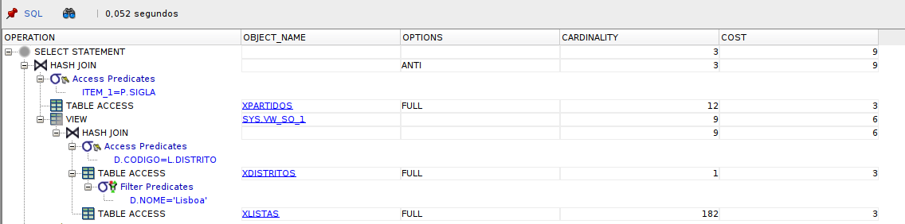

* Y environment

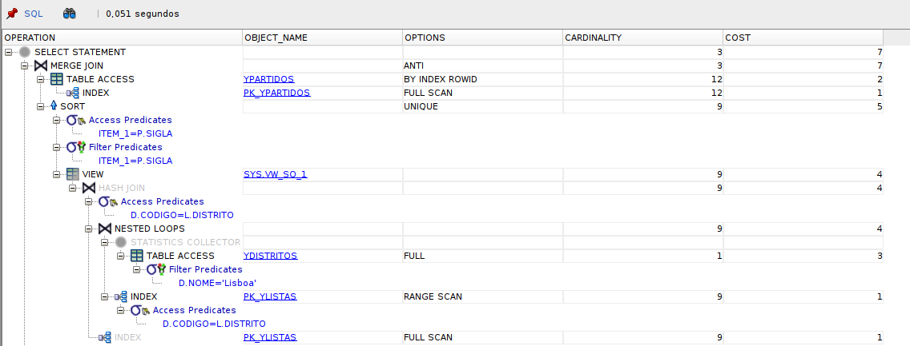

* Z environment

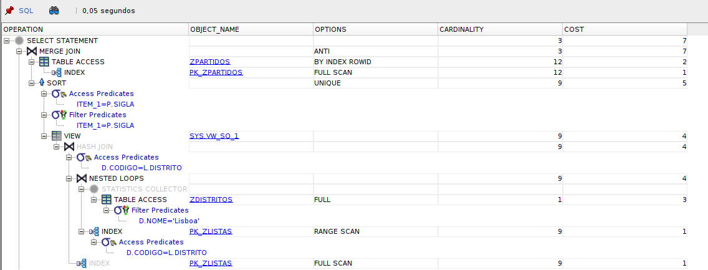

#### Analysis

This is a **negative query**, so Oracle turns it into an **anti-join**.

In **X**, the plan is the simplest but also the least efficient. Oracle does **full table scans** on `partidos`, `listas`, and `distritos`, and uses a **hash anti join** to remove the parties that do appear in Lisbon. Since there are no helpful indexes, it has to read the tables almost entirely before it can return the result. The cost is **9**.

In **Y**, the plan improves a bit. Oracle uses the primary key on `partidos` with a **unique scan**, and the subquery for Lisbon is processed with a more efficient join strategy. `listas` can also be reached by index on the district side, so the database does less work than in X. The cost drops to **7**.

In **Z**, the plan is basically the same as in **Y**. The extra index does not bring a big visible change here, because the key access path on `listas` already works well for this query. The cost stays at **7**, and the execution time is almost the same.

So the main conclusion is that **X** relies on scans, while **Y** and **Z** use better access paths and a more efficient anti-join. The extra index in **Z** does not make a big difference for this specific query.


## 4. Universal Query

(Unfinished)


## 5. Compare execution plans for the query: “How many votes did PS and PSD obtain in districts 11, 15, and 17?” considering in environment Z:

All the queries according to this step can be checked on the file [sql/5-comparing-z.sql](./sql/5-comparing-z.sql).

### SQL main query

``` SQL
SELECT c.distrito, v.partido, SUM(NVL(v.votos, 0)) AS total_votos
FROM zvotacoes v
JOIN zfreguesias f ON f.codigo = v.freguesia
JOIN zconcelhos c  ON c.codigo = f.concelho
WHERE c.distrito IN (11, 15, 17) AND v.partido IN ('PS', 'PSD')
GROUP BY c.distrito, v.partido
ORDER BY c.distrito, v.partido;
```

### Result
```
  DISTRITO PARTIDO    TOTAL_VOTOS
---------- ---------- -----------
        11 PS              480410
        15 PS              170193
        17 PS               50691
```

#### a. Using B-tree indexes on zconcelhos.distrito e zvotacoes.partido.

Before running the main query, is necessary to create the B-tree indexes.

``` SQL
-- Creating b-tree indexes
CREATE INDEX idx_zconcelhos_distrito
ON zconcelhos (distrito);

CREATE INDEX idx_zvotacoes_partido
ON zvotacoes (partido);
```

#### b. Using bitmap indexes.

Before running the main query, is necessary to create the B-tree indexes.

``` SQL
-- Creating bitmap indexes
DROP INDEX idx_zconcelhos_distrito;
DROP INDEX idx_zvotacoes_partido;

CREATE BITMAP INDEX bix_zconcelhos_distrito
ON zconcelhos (distrito);

CREATE BITMAP INDEX bix_zvotacoes_partido
ON zvotacoes (partido);
```

#### Execution plans and estimate the effort required
* Using B-tree

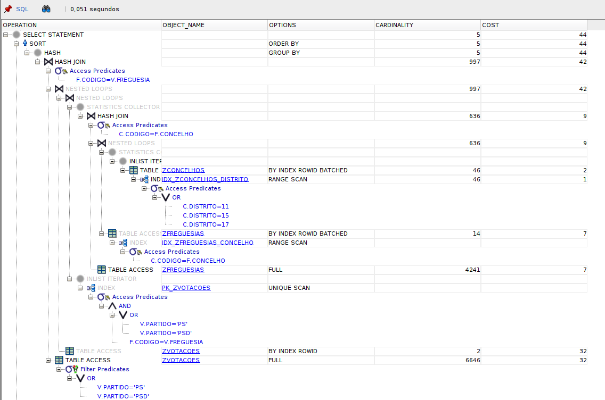

* Using bitmap

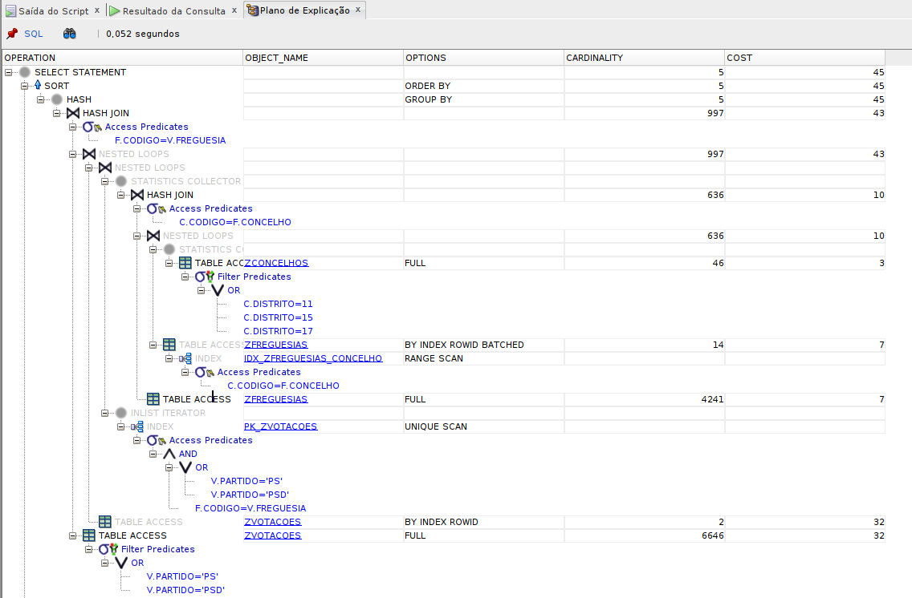


#### Analysis

In this query, the **B-tree version is slightly better than the bitmap version**.

With **B-tree indexes**, Oracle uses `IDX_ZCONCELHOS_DISTRITO` with an **index range scan**, so it can reach the districts 11, 15, and 17 more directly. It also uses the primary key index on `zvotacoes` with a **unique scan**. Because of that, the cost is **44**.

With **bitmap indexes**, the plan is almost the same, but Oracle does **not really take advantage of the bitmap indexes here**. The plan still ends up doing a **full scan** on `zconcelhos` and `zvotacoes` in the important parts, so the cost goes up a little to **45**. The execution time is also basically the same, around **0.052s**.

So, for this query, the **B-tree indexes work better**. The bitmap indexes do not bring a real gain, probably because the query is small and the optimizer already has a good path with the B-tree indexes. In practice, the difference is very small, but B-tree still wins here.
